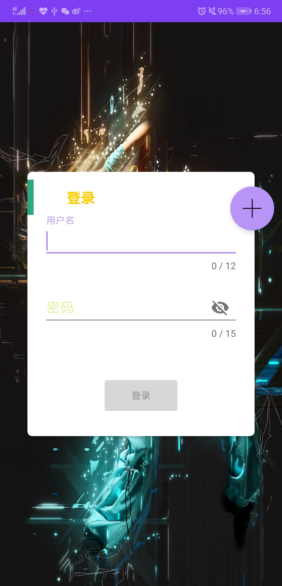

[TOC]


# NOWFITNESS 简介

+ **名称:** NOWFITNESS
+ **标签:**  运动健身+社交
+ **介绍:** 这是一个集社交和运动健康于一体的app，该应用能为用户记录每日运动数据，能根据用户的喜好和个人身体情况推荐其相应的运动。并提供了一个简约的社交圈，让用户结交更多志同道合的人，在运动的路上不在孤单

# 一、主体框架模块

## 主页面

> **介绍** 该部分包含 **动态主页面** 和 **个人中心** 两个fragment,以及在本界面启动 **计步service**

#### 1.1 View

+ 
+ **BottomNavigation使用的开源库**
    ```
    'com.aurelhubert:ahbottomnavigation:2.1.0'
    ```

+ View的成员与函数

   | 成员             | 类型                 | 访问权限 | 描述                  |
   | ---------------- | -------------------- | -------- | --------------------- |
   | type             | int                  | private  | 该动态的类型          |
   | userViewFragment | UserViewFragment     | private  | 个人页面Fragment      |
   | addButton        | FloatingActionButton | private  | 用于发表动态的FAB按钮 |
   | bottomNavigation | AHBottomNavigation   | private  | 底部导航栏            |

   | 方法            | 访问权限 | 返回值 | 描述                                                  |
   | --------------- | -------- | ------ | ----------------------------------------------------- |
   | initView()      | private  | void   | 初始化View,内调用initFragment，initEvent，setListener |
   | setListener()   | private  | void   | 设置FAB按钮的监听事件                                 |
   | initFragment()  | private  | void   | 初始化动态Fragment,并将其添加进bottomNavigation中     |
   | initEvent()     | private  | void   | 初始化bottomNavigation的点击事件                      |
   | onBackPressed() | public   | void   | 处理手机自带的Back监听对Fragment栈产生的影响          |
   | setupService()  | private  | void   | 启动计步service                                       |

# 二、用户基本信息模块

## LoginAndRegisterView（登录界面）

> 包含**登录界面**和**注册界面**
>
> **介绍** 该部分实现**登录并跳转到主页面**以及**跳转到注册页面**的功能
>
> implements **LoginMethod**

#### 1.1 View

- 

- View的成员与函数

  | 成员             | 类型                 | 访问权限 | 描述                        |
  | ---------------- | -------------------- | -------- | --------------------------- |
  | type             | int                  | private  | 该动态的类型                |
  | loginPresenter   | LoginPresenter       | private  | 处理登录网络交互的Presetner |
  | userName         | TextInputEditText    | private  | 用户名输入控件              |
  | passWord         | TextInputEditText    | private  | 密码输入控件                |
  | userNameLayout   | TextInputLayout      | private  | 用户名输入Layout            |
  | passWordLayout   | TextInputLayout      | private  | 密码输入Layout              |
  | loginButton      | Button               | private  | 登录按钮                    |
  | switchToRegister | FloatingActionButton | private  | 跳转到注册的按钮            |

  | 方法                                                     | 访问权限 | 返回值 | 描述                                                         |
  | -------------------------------------------------------- | -------- | ------ | ------------------------------------------------------------ |
  | initView()                                               | public   | void   | 初始化View,内调用setListener                                 |
  | setListener()                                            | private  | void   | 设置FAB按钮的监听事件,以及input控件的输入监听和登录按钮的点击监听 |
  | userNameSetError(String error)                           | public   | void   | 设置userNameInput控件的错误信息                              |
  | passWordSetError(String error)                           | public   | void   | 设置passWordInput控件的错误信息                              |
  | loginSuccess(ResponseModel<Token> responseModel)         | public   | void   | 登录成功后进行的处理                                         |
  | netError(Throwable e)                                    | private  | void   | 网络连接失败后进行的处理                                     |
  | querySuccess(ResponseModel<UserInfoModel> responseModel) | private  | void   | 请求个人信息后进行的处理                                     |


#### 1.2 Presenter

- **LoginPreseter**

  > **extends** BasePresenter

  - **详情描述**

    | 成员        | 类型        | 访问权限 | 描述                       |
    | ----------- | ----------- | -------- | -------------------------- |
    | loginView   | LoginView   | private  | 登录View                   |
    | loginMethod | LoginMethod | private  | 网络请求获取数据回调的接口 |

    | 方法                                                        | 访问  权限 | 返回值  | 描述                      |
    | ----------------------------------------------------------- | ---------- | ------- | ------------------------- |
    | LoginPresenter(LoginView loginView,LoginMethod loginMethod) | public     | 无      | 构造函数                  |
    | initView()                                                  | public     | void    | 初始化LoginView的view设置 |
    | verifyForUserName(String userName)                          | public     | boolean | 验证用户名是否正确        |
    | verifyForPassWord(String userName)                          | public     | boolean | 验证密码是否正确          |
    | queryForVerify(String userName, String passWord)            | public     | void    | 请求登录                  |
    | queryForUserInfo(String userName)                           | public     | void    | 请求个人信息              |

## 注册界面

> **介绍** 该部分实现**注册并跳转到主页面**以及**跳转到登录页面**的功能

> implements **LoginMethod**

#### 2.1 View

- 

- View的成员与函数

  | 成员                 | 类型                 | 访问权限 | 描述                        |
  | -------------------- | -------------------- | -------- | --------------------------- |
  | type                 | int                  | private  | 该动态的类型                |
  | registerPresenter    | RegisterPresenter    | private  | 处理登录网络交互的Presetner |
  | userName             | TextInputEditText    | private  | 用户名输入控件              |
  | passWord             | TextInputEditText    | private  | 密码输入控件                |
  | repeatPassWord       | TextInputEditText    | private  | 确认密码输入控件            |
  | userNameLayout       | TextInputLayout      | private  | 用户名输入Layout            |
  | passWordLayout       | TextInputLayout      | private  | 密码输入Layout              |
  | repeatPassWordLayout | TextInputLayout      | private  | 确认密码输入Layout          |
  | submitButton         | Button               | private  | 注册按钮                    |
  | cancelButton         | FloatingActionButton | private  | 跳转到注册的按钮            |
  | registerCardView     | CardView             | private  | 注册页面的CardView          |

  | 方法                                                     | 访问权限 | 返回值 | 描述                                                         |
  | -------------------------------------------------------- | -------- | ------ | ------------------------------------------------------------ |
  | initView()                                               | public   | void   | 初始化View,内调用initListener                                |
  | setListener()                                            | private  | void   | 设置FAB按钮的监听事件,以及input控件的输入监听和注册按钮的点击监听 |
  | animateRevealShow()                                      | public   | void   | 设置FAB进入View动画                                          |
  | animateRevealClose()                                     | public   | void   | 设置FAB结束View动画                                          |
  | registerSuccess(ResponseModel<Token> responseModel)      | public   | void   | 登录成功后进行的处理                                         |
  | netError(Throwable e)                                    | private  | void   | 网络连接失败后进行的处理                                     |
  | querySuccess(ResponseModel<UserInfoModel> responseModel) | private  | void   | 请求个人信息后进行的处理                                     |
  | userNameSetError(String error)                           | public   | void   | 设置userNameInput控件的错误信息                              |
  | passWordSetError(String error)                           | public   | void   | 设置passwordInput控件的错误信息                              |
  | repeatPassWordError(String error)                        | public   | void   | 设置repeatPasswordInput控件的错误信息                        |

#### 2.2 Presenter

- **LoginPreseter**

  > **extends** BasePresenter

  - **详情描述**

    | 成员           | 类型           | 访问权限 | 描述                       |
    | -------------- | -------------- | -------- | -------------------------- |
    | registerView   | RegisterView   | private  | 登录View                   |
    | registerMethod | RegisterMethod | private  | 网络请求获取数据回调的接口 |

    | 方法                                                         | 访问  权限 | 返回值  | 描述                       |
    | ------------------------------------------------------------ | ---------- | ------- | -------------------------- |
    | RegisterPresenter(RegisterView registerView, RegisterMethod registerMethod) | public     | 无      | 构造函数                   |
    | initView()                                                   | public     | void    | 初始化LoginView的view设置  |
    | verifyForUserName(String userName)                           | public     | boolean | 验证用户名是否正确         |
    | verifyForPassWord(String userName)                           | public     | boolean | 验证密码是否正确           |
    | verifyPassWordAgain(String passWord, String passWordTwo)     | public     | boolean | 验证重复输入的密码是否正确 |
    | applyRegister(String userName, String passWord)              | public     | void    | 申请账户                   |
    | queryForUserInfo(String userName)                            | public     | void    | 请求个人信息               |
    | showAnimate()                                                | public     | void    | 显示动画信息               |


## UserView(个人中心)

> 在本目录下包含**个人中心界面**和**关注以及粉丝列表界面**
> **介绍** 可以对个人信息进行操作的界面。可以更换用户头像,进入关注和分析列表,回顾个人动态,回顾打卡状态,查看数据分析,设置昵称修改密码等

#### 1.1 View

+ 

+ **UserViewFragment**

    > implements **CalendarControlMethod UserViewMethod SensorEventListener ToPersonPageView**

    + **日历使用的开源库**
        ```
        'com.haibin:calendarview:3.4.8'
        ```
    + **圆形Image使用的开源库**
        ```
        'de.hdodenhof:circleimageview:2.2.0'
        ```
    + **圆形分层Button使用的开源库**
        ```
        'com.victor.ringbutton:lib:1.0.1'
        ```

    + View的成员与函数

       | 成员              | 类型            | 访问权限 | 描述                    |
       | ----------------- | --------------- | -------- | ----------------------- |
       | userViewPresenter | SecureRandom    | private  | 用于交互信息的Presetner |
       | monthDay          | TextView        | private  | 月                      |
       | yearDay           | TextView        | private  | 年                      |
       | lunarDay          | TextView        | private  | 农历                    |
       | currentDay        | TextView        | private  | 日                      |
       | calendarView      | CalendarView    | private  | 日历View                |
       | avatarImageView   | CircleImageView | private  | 头像Image               |
       | momentLayout      | LinearLayout    | private  | 动态Layout              |
       | followLayout      | LinearLayout    | private  | 关注的人Layout          |
       | fansLayout        | LinearLayout    | private  | 粉丝Layout              |
       | momentNum         | TextView        | private  | 动态数                  |
       | fansNum           | TextView        | private  | 粉丝数                  |
       | followersNum      | TextView        | private  | 关注数                  |
       | heightNum         | EditText        | private  | 身高                    |
       | weightNum         | EditText        | private  | 体重                    |
       | BMINum            | TextView        | private  | BMI值                   |
       | sexImage          | ImageView       | private  | 性别Image               |
       | nickName          | TextView        | private  | 昵称                    |
       | myView            | View            | private  | 用于存储View的变量      |
       | settingButton     | RingButton      | private  | 设置按钮                |
       | sensorManager     | SensorManager   | private  | 管理传感器的Manager     |
       | accelerateSensor  | Sensor          | private  | 加速度传感器            |
       | isShake           | boolean         | private  | 标志是否在晃动的标志量  |
       | dialog            | AlertDialog     | private  | 摇一摇时弹出的对话框    |

       | 方法                                                         | 访问权限 | 返回值   | 描述                                                        |
       | ------------------------------------------------------------ | -------- | -------- | ----------------------------------------------------------- |
       | initView()                                                   | public   | void     | 初始化View,内调用initUserView，initCalendarView，initDialog |
       | initUserView()                                               | private  | void     | 初始化除日历外其他控件,并调用setListener                    |
       | initCalendarView()                                           | private  | void     | 初始化日历控件,内包含setInitView                            |
       | initDialog()                                                 | private  | void     | 初始化弹出的对话框信息                                      |
       | setInitView()                                                | private  | void     | 将请求获得UserInfoModel中的信息更新到所有与之有关的空间中   |
       | getSchemeCalendar(int year, int month, int day, String text) | public   | Calendar | 初始化日历中的一些信息并获得该日历                          |
       | stringConvertToDate(String dateString)                       | public   | Date     | String向Date的转换函数                                      |
       | setListener()                                                | public   | void     | 设置layout、button以及Image的点击监听事件                   |
       | setBMINum()                                                  | public   | void     | 设置BMI值                                                   |
       | onStart()                                                    | public   | void     | 注册传感器                                                  |
       | onPause()                                                    | public   | void     | 解绑传感器                                                  |
       | onSensorChanged(SensorEvent sensorEvent)                     | public   | void     | 当振动超过一定幅度时,响应摇一摇操作                         |
       | onActivityResult(int requestCode, int resultCode, Intent data) | public   | void     | 响应更换头像的操作                                          |
       | jumpToPersonPage(int id, String userName, String nickName, String personPhoto) | public   | void     | 跳转到个人页面                                              |
       | shakeSuccess(String s)                                       | public   | void     | 摇一摇成功                                                  |
       | queryError(Throwable e)                                      | public   | void     | 网络请求失败                                                |
       | applyForImageChange(ResponseModel model)                     | public   | void     | post头像成功                                                |

#### 1.2 Model
+ **存储个人信息的类**

  + **UserInfoLab**

    > **静态类** 可在任何地方调用以获取当前app状态下,所登录的用户的信息UserInfoModel

  + **UserInfoModel**
    >说明** 以下成员均private类型，且均设有get和set方法
    >**此类的信息同时在本地数据库存储**

    | 成员            | 类型                       | 描述                                                      |
    | --------------- | -------------------------- | --------------------------------------------------------- |
    | id              | long                       | 用户id                                                    |
    | userName        | String                     | 用户名                                                    |
    | nickName        | String                     | 昵称                                                      |
    | password        | String                     | 密码(加密过后)                                            |
    | height          | double                     | 身高                                                      |
    | weight          | double                     | 体重                                                      |
    | sex             | String                     | 性别                                                      |
    | age             | int                        | 年龄                                                      |
    | pictureUrl      | String                     | 头像的地址(在后台的地址)                                  |
    | followingNum    | int                        | 关注的人的数量                                            |
    | fansNum         | int                        | 粉丝数量                                                  |
    | momentsNum      | int                        | 动态数量                                                  |
    | dateCheckString | String                     | 打卡日期组成的长String                                    |
    | salt            | String                     | 用于部分加密的偏移字符串                                  |
    | dateCheckList   | List<String>               | 存储打卡日期的List **该项本地数据库不存储**               |
    | convert         | StringAndListConvertMethod | 将String转换成List<String>的变量 **该项本地数据库不存储** |


#### 1.3 Presenter
+ **UserViewPresenter**

  > **extends** BasePresenter

  + **详情描述**

    | 成员             | 类型             | 访问权限 | 描述                         |
    | ---------------- | ---------------- | -------- | ---------------------------- |
    | userView         | UserViewFragment | private  | 个人中心的View               |
    | userViewMethod   | UserViewMethod   | private  | 网络请求获取数据回调的接口   |
    | userInfoModel    | UserInfoModel    | private  | 个人数据Model                |
    | userInfoModelDao | UserInfoModelDao | private  | 存储个人信息的表(本地数据库) |

    | 方法                                                         | 访问  权限 | 返回值 | 描述               |
    | ------------------------------------------------------------ | ---------- | ------ | ------------------ |
    | UserViewPresenter(UserViewFragment userView, UserViewMethod userViewMethod) | public     | 无     | 构造函数           |
    | initView()                                                   | public     | void   | 初始化View中的信息 |
    | setWeight(String weight)                                     | public     | void   | 设置体重           |
    | setHeight(String height)                                     | public     | void   | 设置身高           |
    | getBMINum()                                                  | public     | double | 获得计算后的BMI值  |
    | setAvatar(String imageUrl)                                   | public     | void   | 设定头像           |
    | postAvatar(String uri, int userId)                           | public     | void   | 传递头像到后台     |


## 关注以及粉丝列表界面

> **介绍** 可以查看关注的人或者粉丝的信息列表

#### 2.1 View

+ 

+ **DisplayView**

    > implements **DisplayViewMethod SwipeRefreshLayout.OnRefreshListener ToPersonPageView**

    + View的成员与函数
        | 成员                | 类型               | 访问权限 | 描述                       |
        | ------------------- | ------------------ | -------- | -------------------------- |
        | displayPresenter    | DisplayPresenter   | private  | 用于数据交互的presetner    |
        | displayRecyclerView | RecyclerView       | private  | 展示信息列表               |
        | swipeRefreshLayout  | SwipeRefreshLayout | private  | 刷新layout                 |
        | type                | int                | private  | 标记是粉丝列表还是关注列表 |
        | isRefresh           | boolean            | private  | 判断当前是否在刷新         |

        | 方法                                                         | 访问权限 | 返回值  | 描述                                                         |
        | ------------------------------------------------------------ | -------- | ------- | ------------------------------------------------------------ |
        | initView()                                                   | public   | void    | 初始化View,内调用setToolbar，setDisplayText，initSwipeLayout |
        | setToolbar()                                                 | private  | void    | 初始化toolbar控件                                            |
        | initSwipeLayout()                                            | private  | void    | 初始化刷新Layout                                             |
        | setDisplayText()                                             | private  | void    | 设置左上角显示的文字是粉丝列表还是关注列表                   |
        | queryForSuccess(ResponseModel<IndividualsList> modelList)    | public   | void    | 当请求用户信息成功时执行的操作                               |
        | queryError(Throwable e)                                      | public   | void    | 当请求失败时执行的操作                                       |
        | onOptionsItemSelected(MenuItem item)                         | public   | boolean | 当点击toolbar按钮时执行的操作                                |
        | jumpToPersonPage(int id, String userName, String nickName, String personPhoto) | public   | void    | 当点击某一行用户时执行的操作                                 |
        | onRefresh()                                                  | public   | void    | 当在刷新状态时执行的操作                                     |

+ **DisplayViewAdapter**

    > extend  **RecyclerView.Adapter<DisplayViewVHolder>**
    + View的成员与函数

       | 成员             | 类型                  | 访问权限 | 描述                    |
       | ---------------- | --------------------- | -------- | ----------------------- |
       | individualModels | List<IndividualModel> | private  | 用户信息列表            |
       | displayPresenter | DisplayPresenter      | private  | 用于交互信息的Presetner |

       | 方法                                                         | 访问权限 | 返回值           | 描述     |
       | ------------------------------------------------------------ | -------- | ---------------- | -------- |
       | DisplayViewAdapter(List<IndividualModel> list, DisplayPresenter displayPresenter) | public   | 无               | 构造函数 |
       | onCreateViewHolder(@NonNull ViewGroup parent, int viewType)  | public   | DisplayViewVHold |          |
       | onBindViewHolder(@NonNull DisplayViewVHolder holder, int position) | public   | void             |          |
       | getItemCount()                                               | public   | int              |          |

+ **DisplayViewVHolder**

> extend  **RecyclerView.ViewHolder**
>
>   + View的成员与函数
>      | 成员            | 类型            | 访问权限 | 描述                    |
>      | --------------- | --------------- | -------- | ----------------------- |
>      | avatar          | CircleImageView | private  | 头像                    |
>      | nickName        | TextView        | private  | 昵称                    |
>      | sex             | TextView        | private  | 性别                    |
>      | individualModel | IndividualModel | private  | 存储个人信息的model     |
>      | switchButton    | AppCompatButton | private  | 切换关注的按钮          |
>      | followPresenter | FollowPresenter | private  | 用于交互信息的Presetner |
>
>      | 方法                                                         | 访问权限 | 类型 | 描述                                                    |
>      | ------------------------------------------------------------ | -------- | ---- | ------------------------------------------------------- |
>      | DisplayViewVHolder(LayoutInflater inflater, ViewGroup parent) | public   | 无   | 构造函数                                                |
>      | setSwitchButton(boolean judge)                               | private  | void | 更换按钮状态,内根据条件语句调用setFollow或者setUnFollow |
>      | setUnFollow()                                                | private  | void | 将按钮设为未关注                                        |
>      | setFollow()                                                  | private  | void | 将按钮设为关注                                          |
>      | bind(final IndividualModel individual)                       | public   | void | 给控件绑定监听事件                                      |


+ **DisplayNoItemAdapter && DisplayViewNoItemHolder**

  > 大致与**DispalyItemAdapter 与 DisplayViewItemHolder**相同,用来处理没有关注的人时的情况,所用变量与方法很少,故此处不赘述。


#### 2.2 Model

- **存储个人信息的类**

  - **IndividualsList**

    > **说明** 以下成员均private类型，且均设有get和set方法

    | 成员             | 类型                  | 描述                   |
    | ---------------- | --------------------- | ---------------------- |
    | totalNum         | int                   | 请求得到的用户信息数量 |
    | individualModels | List<IndividualModel> | 用来存储用户信息的List |


  - **IndividualModel**

    > **说明** 以下成员均private类型，且均设有get和set方法

    | 成员     | 类型    | 描述             |
    | -------- | ------- | ---------------- |
    | id       | int     | 用户id           |
    | userName | String  | 用户名           |
    | nickName | String  | 昵称             |
    | picture  | String  | 头像的地址       |
    | sex      | String  | 性别             |
    | stated   | boolean | 用户之间关注状态 |


#### 2.3 Presenter

- **DisplayPresenter**

  > **extends** BasePresenter

  - **详情描述**

    | 成员              | 类型              | 访问权限 | 描述                       |
    | ----------------- | ----------------- | -------- | -------------------------- |
    | displayView       | DisplayView       | private  | 列表的View                 |
    | displayViewMethod | DisplayViewMethod | private  | 网络请求获取数据回调的接口 |

    | 方法                                                         | 访问  权限 | 返回值 | 描述               |
    | ------------------------------------------------------------ | ---------- | ------ | ------------------ |
    | DisplayPresenter(DisplayView displayView, DisplayViewMethod displayViewMethod) | public     | 无     | 构造函数           |
    | initView()                                                   | public     | void   | 初始化View中的信息 |
    | queryForFollowingOrFansInfo(int type)                        | public     | void   | 请求用户信息       |
    | jumpToPersonPage(int id, String userName, String nickName, String personPhoto) | public     | void   | 跳转页面           |

- **FollowPresenter**

  > **extends** BasePresenter

  - **详情描述**

      | 方法                                      | 访问  权限 | 返回值 | 描述                   |
      | ----------------------------------------- | ---------- | ------ | ---------------------- |
      | postFollowInfo(int userId,int followId)   | public     | void   | 向后台传递关注信息     |
      | deleteFollowInfo(int userId,int followId) | public     | void   | 向后台传递取消关注信息 |


## UserSettingView(个人设置页面)

> **介绍** 该View为进行个人设置的View
>
> implements **UserSettingMethod**

#### 1.1 View

+ 


+ View的成员与函数

   | 成员                 | 类型                 | 访问权限 | 描述                             |
   | -------------------- | -------------------- | -------- | -------------------------------- |
   | userInfoSetting      | CardView             | private  | 用于设置个人信息的CardView       |
   | passWordSetting      | CardView             | private  | 用于设置密码的CardView           |
   | passWordDialog       | AlertDialog          | private  | 用于设置密码的Dialog             |
   | userInfoDialog       | AlertDialog          | private  | 用于设置个人信息的Dialog         |
   | userSettingPresenter | UserSettingPresenter | private  | 用于交互数据的Presenter          |
   | logoutButton         | AppCompatButton      | private  | 用于退出登陆的按钮               |
   | ageInfo              | EditText             | private  | 用于输入年龄的控件               |
   | nickNameText         | TextInputEditText    | private  | 用于输入昵称的控件               |
   | oldPassword          | TextInputEditText    | private  | 用于输入当前密码的控件           |
   | newPassword          | TextInputEditText    | private  | 用于输入新的密码的控件           |
   | repeatPassword       | TextInputEditText    | private  | 用于重复输入来确认密码正确的控件 |
   | sex                  | String               | private  | 用来存储性别信息                 |

   | 方法                                                         | 访问权限 | 返回值  | 描述                                                         |
   | ------------------------------------------------------------ | -------- | ------- | ------------------------------------------------------------ |
   | initView()                                                   | private  | void    | 初始化View,内调用setUpPassWordDialog、setUpUserInfoDialog、setListener与setToolbar |
   | setListener()                                                | private  | void    | 设置输入以及按钮的监听                                       |
   | setUpPassWordDialog                                          | private  | void    | 初始化修改密码的dialog                                       |
   | setToolbar()                                                 | private  | void    | 初始化toolbar                                                |
   | setUpUserInfoDialog()                                        | private  | void    | 初始化修改个人信息的dialog                                   |
   | onOptionsItemSelected(MenuItem item)                         | public   | boolean | 设置对toolbar按钮的回调                                      |
   | verifyInfo(String userName, String age, String sex)          | public   | boolean | 验证对个人信息的修改是否符合要求                             |
   | verifyPassword(String oldPassword,String newPassword,String repeatWord) | private  | boolean | 验证对密码的更改是否符合要求                                 |
   | putSuccess(ResponseModel responseModel)                      | public   | void    | 成功Put个人信息时调用函数                                    |
   | putError(Throwable e)                                        | public   | void    | 网络连接失败时调用函数                                       |
   | changeSuccess(ResponseModel<SaltModel> saltModelResponseModel) | public   | void    | 成功更改密码时调用函数                                       |

#### 1.2 Model
+ **SaltModel**

  > 说明** 以下成员均private类型，且均设有get和set方法

  | 成员 | 类型   | 描述                         |
  | ---- | ------ | ---------------------------- |
  | salt | String | 用于密码加密的偏移字符串信息 |

#### 1.3 Presenter

+ **UserSettingPresenter**

  >**extends**  BasePresenter
  >
  >**implements** ToPersonPageView

  | 成员              | 类型              | 访问权限 | 描述               |
  | ----------------- | ----------------- | -------- | ------------------ |
  | userSettingMethod | UserSettingMethod | private  | 请求网络的回调接口 |

  | 方法                                                      | 访问权限 | 返回值 | 描述                 |
  | --------------------------------------------------------- | -------- | ------ | -------------------- |
  | UserSettingPresenter(UserSettingMethod userSettingMethod) | public   | void   | 构造函数             |
  | putUserInfo(UserInfoModel userInfoModel)                  | public   | void   | put要更替的用户信息  |
  | changePassword(String newPassword)                        | public   | void   | post要更换的密码信息 |


# 三、社交模块

## LeftView (动态主页面)

> 1. 健身书籍轮播图
> 2. 社交动态	

### 1. LeftView(健身书籍部分）

> **介绍** 该部分显示健身书籍的图片和名字的轮播图，用户可以点击查看详情

#### 1.1 View 

- 

- **轮播图使用的开源库 **

  - ```
    'com.youth.banner:banner:1.4.10'
    ```

#### 1.2 Model 

- **健身书籍的数据来源** :豆瓣apiV2 https://api.douban.com/v2/book/

- **书籍的类**

  - **DoubanBookModel**

    > 说明** 以下成员均private类型，且均设有get和set方法

    | 成员      | 类型           | 描述                   |
    | --------- | -------------- | ---------------------- |
    | rating    | RatingBean     | 书籍评分相关信息       |
    | subtitle  | String         | 副标题                 |
    | pubdate   | String         | 发行时间               |
    | title     | String         | 书籍标题               |
    | image     | String         | 书籍图片链接           |
    | catalog   | String         | 所属分类目录           |
    | summary   | String         | 简介                   |
    | publisher | String         | 发行商                 |
    | tags      | List<TagsBean> | 书籍所带标签           |
    | url       | String         | 豆瓣书籍详情页面的链接 |
    | author    | List<String>   | 作者                   |

    - **TagBean**

      | 成员  | 类型   | 描述     |
      | ----- | ------ | -------- |
      | count | String | 标签个数 |
      | name  | String | 标签名字 |

    - **RatingBean**

      | 成员      | 类型   | 描述         |
      | --------- | ------ | ------------ |
      | numRaters | int    | 参与评分人数 |
      | average   | String | 平均评分     |

#### 1.3 Presenter

- **BookPreseter**

  > **extends** BasePresenter

  - **详情描述**

    | 成员       | 类型                  | 访问权限 | 描述                       |
    | ---------- | --------------------- | -------- | -------------------------- |
    | bookLab    | List<DoubanBookModel> | private  | 存储书籍的详细信息的数组   |
    | bookBanner | Banner                | private  | 轮播图                     |
    | title      | List<String>          | private  | 存储每本书籍名字的数组     |
    | images     | List<String>          | private  | 存储每本书籍图片的数组     |
    | mContext   | Context               | private  | 场景（动态主页面）         |
    | bookMethod | BookMethod            | private  | 网络请求获取数据回调的接口 |

    | 方法                                                 | 访问  权限 | 返回值 | 描述                               |
    | ---------------------------------------------------- | ---------- | ------ | ---------------------------------- |
    | BookPresenter(Context context,BookMethod bookMethod) | public     | 无     | 构造函数                           |
    | initBanner()                                         | public     | void   | 初始化banner的设置和数据           |
    | resetBanner()                                        | public     | void   | 网络请求成功后重新设置banner的数据 |
    | getBookInfo(String tag, int start, int count)        | public     | void   | 像网络发起请求，获取数据           |

### 2. LeftView（社交动态部分）

#### 2.1 View 

- **界面效果图**

  

- **上拉刷新使用的开源库**

  ```
  'com.scwang.smartrefresh:SmartRefreshLayout:1.0.5.1'
  ```

- **圆形imageview库**

  ```
  'de.hdodenhof:circleimageview:2.2.0'
  ```

- **MomentsView**

  > **extends**  Fragment 
  >
  > **implements** MomentsMethod , MyQzoneShare

  | 成员                | 类型               | 访问权限 | 描述                           |
  | ------------------- | ------------------ | -------- | ------------------------------ |
  | type                | String             | private  | 该view是关注者还是有缘人的类型 |
  | momentsRecyclerView | RecyclerView       | private  | 动态滑动列表                   |
  | momentsPresenter    | MomentsPresenter   | private  | 动态界面与数据交互媒介         |
  | swipeRefreshLayout  | SwipeRefreshLayout | private  | 下拉刷新框架                   |
  | refreshLayout       | SmartRefreshLayout | private  | 上划加载框架                   |
  | LOAD                | int                | private  | 加载标志                       |
  | REFRESH             | int                | private  | 刷新标志                       |
  | mTencent            | Tencent            | private  | 调用腾讯api的实体类            |

| 方法                                                         | 访问权限 | 返回值      | 描述                                                   |
| ------------------------------------------------------------ | -------- | ----------- | ------------------------------------------------------ |
| newInstance(String type)                                     | public   | MomentsView | 获得一个MomentsView                                    |
| initView()                                                   | public   | void        | 初始化界面中的UI控件                                   |
| intiEvent()                                                  | public   | void        | 初始化界面中空间的动作事件的监听函数                   |
| querySuccess(ResponseModel<MomentsModelList> models)         | public   | void        | 网络请求动态数据成功后的回调                           |
| queryError(Throwable e)                                      | public   | void        | 网络请求动态数据失败后的回调                           |
| queryDifferentMoments(int queryType)                         | private  | void        | 根据该view的type 通过presenter请求不同的类型的动态数据 |
| shareToQZone(Bundle params)                                  | public   | void        | 分享动态到QZONE                                        |
| onActivityResult(int requestCode, int resultCode, Intent data) | public   | void        | 接受其他场景回传的数据                                 |

- **MomentsViewHolder**

  > **在动态列表有内容时的界面**
  >
  > **extends**   RecyclerView.ViewHolder
  >
  > **implements** View.OnClickListener

  | 成员                 | 类型                 | 访问权限 | 描述                           |
  | -------------------- | -------------------- | -------- | ------------------------------ |
  | type                 | int                  | private  | 该动态的类型                   |
  | userPhotoImage       | CircleImageView      | private  | 用户头像图片                   |
  | contentPicImage      | ImageView            | private  | 动态图片                       |
  | nickNameTextView     | TextView             | private  | 用户昵称                       |
  | timeTextView         | TextView             | private  | 发布时间                       |
  | like                 | ImageView            | private  | 点赞图标                       |
  | likeNum              | TextView             | private  | 点赞数                         |
  | commentsNum          | TextView             | private  | 评论数                         |
  | btMenu               | ImageView            | private  | 动态的菜单                     |
  | mMoments             | MomentsModel         | private  | 该动态对应的信息               |
  | baseMomentsPresenter | BaseMomentsPresenter | private  | 该动态界面与数据进行交互的媒介 |
  | myPosition           | myPosition           | private  | 该动态所在动态列表中的位置     |

  | 方法                                                         | 访问权限 | 返回值 | 描述                   |
  | ------------------------------------------------------------ | -------- | ------ | ---------------------- |
  | MomentsViewHolder(View itemView, BaseMomentsPresenter baseMomentsPresenter) | public   | 无     | 构造函数，初始化ui控件 |
  | onBindMomentsData(MomentsModel moments,int pos)              | public   | void   | 绑定数据               |
  | showDialog(String title,String message,int type)             | private  | void   | 显示对话框             |
  | imageLikeClickEvent(View view,UserInfoModel userInfoModel)   | private  | void   | 点击点赞图片相应函数   |
  | menuClickEvent()                                             | private  | void   | 点击菜单的响应函数     |
  | onClick(View view)                                           | public   | void   | 点击事件的监听函数     |

- **EmptyViewHolder**

  > **在动态列表内容为空时的界面**
  >
  > **extends**   RecyclerView.ViewHolder

  | 方法                           | 访问权限 | 返回值 | 描述     |
  | ------------------------------ | -------- | ------ | -------- |
  | EmptyViewHolder(View itemview) | public   | 无     | 构造函数 |

- **LoadingViewHolder**

  > **刚进入页面，加载动态列表时的界面**
  >
  > **extends**   RecyclerView.ViewHolder

  | 方法                             | 访问权限 | 返回值 | 描述     |
  | -------------------------------- | -------- | ------ | -------- |
  | LoadingViewHolder(View itemview) | public   | 无     | 构造函数 |

- **OfflineViewHolder**

  > **断网时动态列表未加载出来时的界面**
  >
  > **extends**   RecyclerView.ViewHolder

  | 方法                             | 访问权限 | 返回值 | 描述     |
  | -------------------------------- | -------- | ------ | -------- |
  | OfflineViewHolder(View itemview) | public   | 无     | 构造函数 |

#### 2.2 Model

- **MomentsModel**

  > 说明** 以下成员均private类型，且均设有get和set方法

  | 成员        | 类型    | 描述                           |
  | ----------- | ------- | ------------------------------ |
  | momentsId   | int     | 动态的id（每个动态唯一的标识） |
  | userId      | int     | 用户 id                        |
  | userPhoto   | String  | 用户头像                       |
  | userName    | String  | 用户名                         |
  | nickName    | String  | 用户昵称                       |
  | image       | String  | 动态图片                       |
  | content     | String  | 动态内容                       |
  | releaseTime | String  | 动态发布时间                   |
  | likes       | int     | 点赞数                         |
  | commentsNum | int     | 评论数                         |
  | liked       | boolean | 本机登陆用户是否点赞           |

  | 方法                                       | 访问权限 | 返回值 | 描述     |
  | ------------------------------------------ | -------- | ------ | -------- |
  | MomentsModel(MomentsDTO.ListBean listBean) | public   | void   | 构造函数 |

#### 2.3 Presenter

- **BaseMomentsPresenter**

  > **extends**  BasePresenter
  >
  > **implements** ToPersonPageView

  | 成员                   | 类型                   | 访问权限  | 描述               |
  | ---------------------- | ---------------------- | --------- | ------------------ |
  | momentsRecyclerAdapter | MomentsRecyclerAdapter | protected | 动态列表适配器     |
  | momentsRecyclerView    | RecyclerView           | private   | 动态列表           |
  | pMomentsLab            | List<MomentsModel>     | protected |                    |
  | pages                  | int                    | protected | 动态的页数         |
  | pageSize               | int                    | protected | 每页的动态数目     |
  | pageNum                | int                    | protected | 动态页码序号       |
  | totalMoments           | int                    | protected | 动态总数           |
  | currentPageSize        | int                    | protected | 当前页面动态数目   |
  | mContext               | Context                | protected | 该类使用的场景     |
  | momentsMethod          | MomentsMethod          | protected | 请求网络的回调接口 |

  | 成员                                                         | 类型   | 访问权限 | 描述                             |
  | ------------------------------------------------------------ | ------ | -------- | -------------------------------- |
  | setAdapterStates(int states)                                 | void   | public   | 设置适配器的状态来适配不同的view |
  | deleteLikeInfo(int momentsId,int likesId)                    | void   | public   | 发送删除点赞的网络请求           |
  | postFollowingInfo(int userId,int followId)                   | void   | public   | 发送关注用户的网络请求           |
  | deleteFollowingInfo(int userId,int followId)                 | void   | public   | 发送取消关注该用户的网络请求     |
  | resetMomentsList(List<MomentsModel> momentsModelList)        | void   | public   | 重设 adapter的数据               |
  | notifyCommentsNumChange(int position,int commentsNum)        | void   | public   | 提醒动态界面评论数的变化         |
  | setShareContent(String title,String summary,String contentUrl,String imageUrl) | Bundle | public   | 打包QZONE 分享的数据             |
  | jumpToPersonPage(int id,String userName,String nickName,String personPhoto) | void   | public   | 跳转到个人信息界面               |

- **MomentsPresenter**

  > 动态主页的presenter
  >
  > **extends**  BaseMomentsPresenter

  | 成员        | 类型        | 访问权限 | 描述     |
  | ----------- | ----------- | -------- | -------- |
  | momentsView | MomentsView | private  | 动态view |

  | 方法                                                         | 访问权限 | 返回值 | 描述                         |
  | ------------------------------------------------------------ | -------- | ------ | ---------------------------- |
  | queryForInfo(int userId,int pageNum)                         | public   | void   | 构造函数                     |
  | queryForNearByInfo(int userId,int pageNum)                   | public   | void   | 网络请求获得有缘人的信息     |
  | addMomentsList(List<MomentsModel> momentsModelList)          | public   | void   | 添加新的动态数据到动态列表中 |
  | jumpToMomentsDetail(MomentsModel momentsModel,int position)  | public   | void   | 跳转到动态详情               |
  | shareToQzone(String title,String summary,String contentUrl,String imageUrl) | public   | void   | 分享到QZONE                  |


## MomentsDetailView(动态详情界面)
> **介绍** 这是个界面中会展示动态底下的评论和回复,用户也可进行评论回复和转发
>
### 1.View

+ **界面效果**

  

+ **MomentsDetailView**

  >**extends** AppCompatActivity 
  >
  >**implements** CommentsMethod, MyQzoneShare, ToPersonPageView

  | 重要成员               | 类型                   | 访问权限 | 描述              |
  | ---------------------- | ---------------------- | -------- | ----------------- |
  | momentsDetailPresenter | MomentsDetailPresenter | private  | 该界面的presenter |
  | mTencent               | Tencent                | private  | 腾讯api调用实体类 |
  | expandableListView     | ExpandableListView     | private  | 二级ListView      |
  | momentsModel           | MomentsModel           | private  | 该动态对象        |
  | dialog                 | BottomSheetDialog      | private  | 底部评论弹窗      |

  | 主要方法                                                     | 访问权限 | 返回值  | 描述                             |
  | ------------------------------------------------------------ | -------- | ------- | -------------------------------- |
  | initEvent()                                                  | public   | void    | 设置UI控件的监听函数             |
  | makeCommentsSuccess(ResponseModel responseModel)             | public   | void    | 请求评论，成功时的回调函数       |
  | makeCommentsError(Throwable e)                               |          |         | 评论失败时的回调函数             |
  | querySuccess(ResponseModel<CommentsDetailModelList> commentsDetailModelsList) | public   | void    | 网络请求评论数据成功时的回调函数 |
  | queryError(Throwable e)                                      | public   | void    | 网络请求评论数据失败时的回调函数 |
  | initExpandableListView(final List<CommentsDetailModel> commentList) | public   | void    | 初始化二级列表及其监听事件       |
  | showCommentDialog( List<CommentsDetailModel> commentsList,final int commentType,   final int groupPosition, final int childPosition) | private  | void    | 显示评论框                       |
  | isCommentable(List<CommentsDetailModel> commentsList,final int commentType,final int groupPosition, final int childPosition) | private  | boolean | 判断是否可以进行评论             |
  | showPopWindows(View v,int childPos,int groupPos)             | private  | void    | 弹出评论窗口                     |
  | jumpToPersonPage(int id, String userName, String nickName, String personPhoto) | public   | void    | 跳转到个人界面                   |
  | shareToQZone(Bundle params)                                  | public   | void    | 分享到QZONE                      |

+ **BaseExHolder**

  > **二级ListViewHolder 的基类	**

  | 成员                   | 类型                   | 访问权限  | 描述               |
  | ---------------------- | ---------------------- | --------- | ------------------ |
  | mContext               | Context                | protected | 场景               |
  | momentsDetailPresenter | MomentsDetailPresenter | protected | 该动态的presenter  |
  | childPosition          | int                    | protected | 子viewholder的位置 |
  | groupPosition          | int                    | protected | 组viewholder位置   |

+ **GroupHolder  GroupMomentsHolder ChildHolder**

  > **extends** BaseExHolder 
  > **implements** View.OnClickListener
  >
  > **说明** 这几个viewholder的功能大同小异 就不在赘述

### 2.Model

+ **CommentsDetailModel**

  >**说明** 以下成员均private类型，且均设有get和set方法

  | 成员             | 类型                     | 描述                           |
  | ---------------- | ------------------------ | ------------------------------ |
  | id               | int                      | 评论的id（每个评论唯一的标识） |
  | momentsId        | int                      | 动态的id（每个动态唯一的标识） |
  | commentUserId    | int                      | 评论者id                       |
  | commentUserPhoto | String                   | 评论者头像                     |
  | commentUserName  | String                   | 评论者用户名                   |
  | commentNickName  | String                   | 评论者昵称                     |
  | image            | String                   | 动态图片                       |
  | content          | String                   | 评论内容                       |
  | commentTime      | String                   | 评论发布时间                   |
  | repliesList      | int                      | 点赞数                         |
  | commentsNum      | List<CommentsReplyModel> | 挂在评论下面的回复             |

### 3.Presenter

+ **MomentsDetailPresenter**

    >**介绍** 是MomentsDetailView服务端数据交互的媒介
    >
    >**extends** BasePresenter

| 成员               | 类型                    | 访问权限 | 描述                         |
| ------------------ | ----------------------- | -------- | ---------------------------- |
| momentsDetailView  | MomentsDetailView       | private  | 动态详情界面view             |
| commentsMethod     | CommentsMethod          | private  | 动态详情界面网络请求回调接口 |
| adapter            | CommentsListViewAdapter | private  | 二级listview适配器           |
| expandableListView | ExpandableListView      | private  | 二级listview                 |

| 主要方法                                                     | 访问权限 | 返回值 | 描述                 |
| ------------------------------------------------------------ | -------- | ------ | -------------------- |
| makeNewReply(CommentsReplyModel commentsReplyModel)          | public   | void   | 添加回复的网络请求   |
| queryForComments(int momentsId)                              | public   | void   | 网络请求评论信息     |
| deleteReply(int groupPos,int childPos)                       | public   | void   | 界面上删除回复       |
| deleteReply(int replyId)                                     | public   | void   | 删除回复的网络请求   |
| addReplyData(int childPosition,int groupPosition,String commentContent) | public   | void   | 添加新的回复到列表中 |
| addCommentData(String commentContent)                        | public   | void   | 添加评论数据         |
| deleteComments(int groupPos)                                 | public   | void   | 删除评论的网络请求   |
| makeNewComments(CommentsDetailModel commentsDetailModel)     | public   | void   | 添加评论的网络请求   |
| shareToQzone(String title,String summary,String contentUrl,String imageUrl) | public   | void   | 分享到QZONE          |
| jumpToPersonPage(int id,String personName,String nickName,String personPhoto) | public   | void   | 跳转到个人社交主页   |


## PersonPageView（用户社交主页）

> **介绍**： 这个界面是每个用户对外界展示自己的平台，包含一部分个人信息和个人动

### 1.View


+ **界面效果**


+ **PersonPageView**

    >**extends** AppCompatActivity
    >
    >**implements** MomentsMethod, MyQzoneShare,PersonPageViewMethod

| 重要成员            | 类型                | 访问权限 | 描述              |
| ------------------- | ------------------- | -------- | ----------------- |
| personPagePresenter | PersonPagePresenter | private  | 该界面的presenter |
| mTencent            | Tencent             | private  | 腾讯api调用实体类 |

| 主要方法                                                     | 访问权限 | 返回值 | 描述                             |
| ------------------------------------------------------------ | -------- | ------ | -------------------------------- |
| initEvent()                                                  | public   | void   | 设置UI控件的监听函数             |
| querySuccess(ResponseModel<MomentsModelList> momentsModelListResponseModel) | public   | void   | 网络请求动态成功时的回调函数     |
| queryInfoSuccess(ResponseModel<UserInfoModel> userInfoModelResponseModel) | public   | void   | 网络请求个人信息成功时的回调函数 |
| queryError(Throwable e)                                      | public   | void   | 网络请求失败时的回调             |
| shareToQZone(Bundle params)                                  | public   | void   | 分享到QZONE                      |
| onActivityResult(int requestCode, int resultCode, Intent data) | public   | void   | 接受动态详情界面回传的数据       |

+ **动态recyclerview部分**

  >复用了动态主页面里
  >
  >MomentsRecyclerAdapter
  >
  >MomentsViewHolder
  >
  >EmptyViewHolder
  >
  >LoadingViewHolder
  >
  >OfflineViewHolder

### 2.Model

+ **MomentsModel**

  >在动态主页界面有详细描述

+ **UserModel**

### 3.Presenter

+ **PersonPagePresenter**

  >**介绍** 是PersonPageView服务端数据交互的媒介
  >
  >**extends** BaseMomentsPresenter

  | 成员                 | 类型                 | 访问权限 | 描述                         |
  | -------------------- | -------------------- | -------- | ---------------------------- |
  | personPageView       | PersonPageView       | private  | 社交个人主页view             |
  | personPageViewMethod | PersonPageViewMethod | private  | 社交个人主页网络请求回调接口 |

  | 主要方法                                                     | 访问权限 | 返回值 | 描述                           |
  | ------------------------------------------------------------ | -------- | ------ | ------------------------------ |
  | getUserMoments(int userID, int pageNum)                      | public   | void   | 网络请求个人动态               |
  | getUserInfo(String userName)                                 | public   | void   | 网络请求个人信息               |
  | getFollowingInfo(int anotherUserId)                          | public   | void   | 网络请求个人关系               |
  | deleteMoments(int position)                                  | public   | void   | 界面上删除动态                 |
  | addMomentsList(List<MomentsModel> momentsModelList)          | public   | void   | 添加获取到的新动态数据到列表中 |
  | jumpToMomentsDetail(MomentsModel momentsModel,int position)  | public   | void   | 跳转到用户动态详情             |
  | shareToQzone(String title,String summary,String contentUrl,String imageUrl) | public   | void   | 分享到QZONE                    |


## PublishMomentView(发表动态)

> **介绍** 该View为发表动态的View
>
> implements **PublishMomentMethod**

#### 1.1 View

+ 
+ **选择图片使用的开源库**
    ```
    'com.zhihu.android:matisse:0.5.2-beta4'
    ```
+ **加载图片使用的开源库**
    ```
    'com.github.bumptech.glide:glide:4.2.0'
    ```

+ View的成员与函数

   | 成员                   | 类型                   | 访问权限 | 描述                        |
   | ---------------------- | ---------------------- | -------- | --------------------------- |
   | type                   | int                    | private  | 该动态的类型                |
   | toolbar                | Toolbar                | private  | View的toolbar               |
   | photoSelected          | ImageView              | private  | 用于选择照片的ImageView     |
   | publishMomentPresenter | PublishMomentPresenter | private  | 用于交互数据的Presenter     |
   | inputText              | AppCompatEditText      | private  | 用于发表Content的Input控件  |
   | imageUri               | List<Uri>              | private  | 用于存储相册返回的List<Uri> |

   | 方法                                                         | 访问权限  | 返回值  | 描述                           |
   | ------------------------------------------------------------ | --------- | ------- | ------------------------------ |
   | initView()                                                   | private   | void    | 初始化View,内调用setListener   |
   | setListener()                                                | private   | void    | 设置照片选择以及输入文字的监听 |
   | onActivityResult(int requestCode, int resultCode, Intent data) | protected | void    | 获取返还的照片Uri,并将其加载   |
   | onOptionsItemSelected(MenuItem item)                         | public    | boolean | 设置toolbar点击监听事件        |
   | postSuccess(ResponseModel responseModel)                     | public    | void    | 成功Post时调用函数             |
   | postError(Throwable e)                                       | public    | void    | 失败Post时调用函数             |


#### 1.2 Presenter
+ **LoginPreseter**

  > **extends** BasePresenter

  + **详情描述**

    | 成员                | 类型                | 访问权限 | 描述                       |
    | ------------------- | ------------------- | -------- | -------------------------- |
    | publishMomentMethod | PublishMomentMethod | private  | 网络请求获取数据回调的接口 |

    | 方法                                                         | 访问  权限 | 返回值  | 描述                                                  |
    | ------------------------------------------------------------ | ---------- | ------- | ----------------------------------------------------- |
    | PublishMomentPresenter(PublishMomentMethod publishMomentMethod) | public     | 无      | 构造函数                                              |
    | postMoment(String content,Uri uri)                           | public     | boolean | 向后台传输发表的动态信息,函数体内选择调用下面两个函数 |
    | postMomentWithFile(RequestBody userId, RequestBody requestContent, MultipartBody.Part part) | private    | void    | 传输有图片的动态                                      |
    | postMomentWithoutFile(RequestBody userId, RequestBody requestContent) | private    | void    | 传输无图片的动态                                      |


# 四、运动健身模块

## BookDetailView(健身书籍详情界面)

> **介绍：** 这个页面包含了健身书籍的详细信息 

### 1.View

> **UI** viewpager

- **界面效果图**

  

- **BooksDetailView**

  > **extends** AppCompatActivity

  | 成员           | 类型                  | 访问权限 | 描述              |
  | -------------- | --------------------- | -------- | ----------------- |
  | bookList       | List<DoubanBookModel> | private  | 动态view          |
  | booksViewPager | ViewPager             | private  | 书籍介绍          |
  | initPos        | int                   | private  | viewpager起始位置 |
  | mToolbar       | Toolbar               | private  | 自定义的toolbar   |

  | 方法                                 | 访问权限 | 返回值  | 描述                      |
  | ------------------------------------ | -------- | ------- | ------------------------- |
  | setToolbar()                         | public   | void    | 设置toolbar               |
  | onOptionsItemSelected(MenuItem item) | public   | boolean | toolbar返回按钮的监听事件 |

- **BooksViewHolder**

  | 成员     | 类型      | 访问权限 | 描述              |
  | -------- | --------- | -------- | ----------------- |
  | bookImg  | ImageView | private  | 书籍图片介绍      |
  | TAG_NUMS | int       | private  | viewpager起始位置 |
  | mToolbar | Toolbar   | private  | 自定义的toolbar   |

  | 方法                                  | 访问权限 | 返回值 | 描述     |
  | ------------------------------------- | -------- | ------ | -------- |
  | onBindData(DoubanBookModel bookModel) | public   | void   | 绑定数据 |

- **BookViewPagerAdapter**

  > **extends** PagerAdapter

  | 成员          | 类型                  | 访问权限 | 描述              |
  | ------------- | --------------------- | -------- | ----------------- |
  | mViewCache    | LinkedList<View>      | private  | page的一个缓存器  |
  | bookModelList | List<DoubanBookModel> | private  | viewpager起始位置 |

  | 方法                                                         | 访问权限 | 返回值 | 描述                                                         |
  | ------------------------------------------------------------ | -------- | ------ | ------------------------------------------------------------ |
  | destroyItem( ViewGroup container, int position,  Object object) | public   | void   | 删除一个page,并把converview加入到viewCache,实现converview的回收利用 |
  | instantiateItem(ViewGroup container, int position)           | public   | void   | 初始化一个page                                               |

### 2.Model

> **DoubanBookModel**
>
> 该类在动态主页面的文档中已有详细说明，在此就不赘述了


## PlanQuestionView(问题调查页面)

> 1. 主页面
> 2. ViewPager中的Fragment
> 3. 结果页面

> **介绍** 摇一摇之后进入的页面

#### 1.1 View

+ **PlanQuestionView**

    + View的成员与函数
        | 成员                         | 类型                         | 访问权限 | 描述           |
        | ---------------------------- | ---------------------------- | -------- | -------------- |
        | viewPager                    | ViewPager                    | private  |                |
        | toolbar                      | Toolbar                      | private  |                |
        | questionFragmentPagerAdapter | QuestionFragmentPagerAdapter | private  |                |
        | questionModelList            | List<Question>               | private  | 存储问题的List |

        | 方法                                 | 访问权限 | 返回值  | 描述                  |
        | ------------------------------------ | -------- | ------- | --------------------- |
        | initView()                           | private  | void    | 初始化View            |
        | onOptionsItemSelected(MenuItem item) | public   | boolean | 设置toolbar的回调事件 |

#### 1.2 Model 

+ **问题的类**

  + **Question**

    >说明** 以下成员均private类型，且均设有get和set方法
    >该类中存储一个问题

    | 成员    | 类型     | 描述 |
    | ------- | -------- | ---- |
    | options | String[] | 选项 |
    | bonus   | int[]    | 分值 |
    | title   | String   | 题目 |

 + **QuestionList**

    >说明** 以下成员均private类型，且均设有get和set方法
    >该类为Single单例类,可随时获取
    >该类存储问题的List

    | 成员         | 类型           | 描述                        |
    | ------------ | -------------- | --------------------------- |
    | questionList | QuestionList   | static变量                  |
    | questions    | List<Question> | 一系列问题                  |
    | score        | int            | 分值                        |
    | bonusIndex   | int[]          | 第i个问题选中的是第几个选项 |

    | 方法             | 访问权限 | 返回值  | 描述                                                |
    | ---------------- | -------- | ------- | --------------------------------------------------- |
    | initList()       | public   | void    | 初始化问题列表                                      |
    | initBonus()      | public   | void    | 初始化选中信息                                      |
    | calculateScore() | public   | boolean | 计算分值,如果存在某一项未进行选择的情况,则返回false |

#### 2.1 View

+ **PlanQuestionView**
  + 

    + View的成员与函数
        | 成员          | 类型     | 访问权限 | 描述               |
        | ------------- | -------- | -------- | ------------------ |
        | questionText  | TextView | private  | 用于显示问题的控件 |
        | chooseA       | Button   | private  | 选项A按钮          |
        | chooseB       | Button   | private  | 选项B按钮          |
        | chooseC       | Button   | private  | 选项C按钮          |
        | chooseD       | Button   | private  | 选项D按钮          |
        | chooseE       | Button   | private  | 选项E按钮          |
        | questionModel | Question | private  | 问题model          |
        | quesIndex     | int      | private  | 所选择选项的索引   |

        | 方法                                                         | 访问权限 | 返回值           | 描述                                |
        | ------------------------------------------------------------ | -------- | ---------------- | ----------------------------------- |
        | newInstance(int index)                                       | public   | QuestionFragment | 生成fragment, index代表是第几个问题 |
        | initView(View view)                                          | private  | void             | 初始化页面                          |
        | bindView(Question questionModel)                             | public   | void             | 将问题绑定到各个控件上,并设置监听   |
        | resetColor(int size,Button buttonA,Button buttonB,Button buttonC,Button buttonD,Button buttonE) | private  | void             | 当选择时,设置按钮颜色变化           |
        | setChooseState()                                             | private  | void             | 设置选择状态                        |

#### 3.1 View

+ **QuestionResultView**
  + 

    + View的成员与函数
        | 成员                    | 类型                    | 访问权限 | 描述                   |
        | ----------------------- | ----------------------- | -------- | ---------------------- |
        | sportsExamples          | List<String>            | private  | 推荐的运动例子         |
        | functions               | List<String>            | private  | 功效                   |
        | people                  | List<String>            | private  | 适用人群               |
        | image                   | int []                  | private  | ui显示                 |
        | questionResultPresenter | QuestionResultPresenter | private  | 用于交互的presenter    |
        | sportsExa               | TextView                | private  | 显示推荐例子的控件     |
        | sportsFun               | TextView                | private  | 显示功效的控件         |
        | sportsPeo               | TextView                | private  | 显示适用人群的控件     |
        | heartImage              | ImageView               | private  | 心脏图片               |
        | finishButton            | Button                  | private  | 完成这一activity的按钮 |
        | type                    | int                     | private  | 标志状态               |

        | 方法                                     | 访问权限 | 返回值  | 描述               |
        | ---------------------------------------- | -------- | ------- | ------------------ |
        | initData()                               | public   | void    | 初始化数据         |
        | initView(View view)                      | private  | void    | 初始化页面         |
        | setListener()                            | public   | private | 设置按钮监听       |
        | postSuccess(ResponseModel responseModel) | public   | void    | 打卡成功时调用     |
        | postError(Throwable e)                   | public   | void    | 网络连接失败时调用 |

#### 3.2 Presenter

- **QuestionResultPresenter**

  > **extends** BasePresenter

  - **详情描述**

    | 成员                 | 类型                 | 访问权限 | 描述                       |
    | -------------------- | -------------------- | -------- | -------------------------- |
    | questionResultMethod | QuestionResultMethod | private  | 网络请求获取数据回调的接口 |

    | 方法                                                         | 访问  权限 | 返回值 | 描述         |
    | ------------------------------------------------------------ | ---------- | ------ | ------------ |
    | QuestionResultPresenter(QuestionResultMethod questionResultMethod) | public     | 无     | 构造函数     |
    | postDailyCheck()                                             | public     | void   | post打卡信息 |


## DataChartView(数据分析页面)

> 1. 主页面
> 2. 对每日的分析画面
> 3. 对周、月的分析画面

> **介绍** 简略的数据分析View(基本是对步数进行分析)

#### 1.1 View

+ **顶部tabLayout使用的开源库 **

  + ```
    'com.flyco.tablayout:FlycoTabLayout_Lib:2.1.2@aar'
    ```

+ **DataChartView**

    + View的成员与函数
        | 成员             | 类型                | 访问权限 | 描述                |
        | ---------------- | ------------------- | -------- | ------------------- |
        | backIcon         | ImageView           | private  | 后退按钮的Image     |
        | switchLayout     | SegmentTabLayout    | private  | tabLayout           |
        | titles           | String[]            | private  | tabLayout的三个标题 |
        | dataChartAdapter | DataChartAdapter    | private  |                     |
        | viewPager        | BanSwipingViewPager | private  |                     |

        | 方法          | 访问权限 | 返回值 | 描述                         |
        | ------------- | -------- | ------ | ---------------------------- |
        | initView()    | private  | void   | 初始化View,内调用setListener |
        | setListener() | private  | void   | 设置监听事件                 |

+ **DataChartAdapter**

    > extend  **FragmentPagerAdapter**
    + View的成员与函数

       | 成员               | 类型           | 访问权限 | 描述                               |
       | ------------------ | -------------- | -------- | ---------------------------------- |
       | dataChartFragments | List<Fragment> | private  | 一个用于存储数据分析Fragment的List |

       | 方法                                              | 访问权限 | 返回值   | 描述                       |
       | ------------------------------------------------- | -------- | -------- | -------------------------- |
       | DataChartAdapter(FragmentManager fragmentManager) | public   | 无       | 构造函数                   |
       | getItem(int position)                             | public   | Fragment | 获得在position出的Fragment |
       | getCount()                                        | public   | int      |                            |

#### 2.1 View

+ 

+ **DayFragment**

> extend  **Fragment**
> implements  **DataChartMethod**
>   + View的成员与函数
>      | 成员               | 类型               | 访问权限 | 描述                    |
>      | ------------------ | ------------------ | -------- | ----------------------- |
>      | dayView            | View               | private  | View                    |
>      | yesterdayCount     | int                | private  | 昨天的步数              |
>      | stepChart          | StepArcView        | private  | 计步弧形图              |
>      | isBind             | boolean            | private  | 是否和service绑定连接   |
>      | stepText           | TextView           | private  | 今日步数                |
>      | stepKm             | TextView           | private  | 今日里程                |
>      | stepEnergy         | TextView           | private  | 今日消耗能量            |
>      | relativeStep       | TextView           | private  | 今日与昨日的相对步数    |
>      | trendImage         | ImageView          | private  | 趋势图                  |
>      | ServiceConnection  | ServiceConnection  | private  | 与计步service的连接     |
>      | dataChartPresenter | DataChartPresenter | private  | 用于交互信息的Presetner |
>
>      | 方法                                                         | 访问权限 | 类型 | 描述                                                        |
>      | ------------------------------------------------------------ | -------- | ---- | ----------------------------------------------------------- |
>      | initView                                                     | private  | void | 初始化view                                                  |
>      | onStart()                                                    | public   | void | 在onStart生命周期内连接计步Service,调用setServiceConnection |
>      | setServiceConnection()                                       | public   | void | 建立连接                                                    |
>      | setRelativeStep(int stepCount)                               | public   | void | 设置UI的相对步数                                            |
>      | querySuccess(ResponseModel<StepModelList> stepModelListResponseModel) | public   | void | 请求昨天步数成功时调用                                      |
>      | queryError(Throwable e)                                      | public   | void | 请求失败时调用                                              |

#### 2.2 Presenter

- **DataChartPresenter**

  > **extends** BasePresenter

  - **详情描述**

    | 成员            | 类型            | 访问权限 | 描述                       |
    | --------------- | --------------- | -------- | -------------------------- |
    | dataChartMethod | DataChartMethod | private  | 网络请求获取数据回调的接口 |

    | 方法                                                | 访问  权限 | 返回值 | 描述             |
    | --------------------------------------------------- | ---------- | ------ | ---------------- |
    | DataChartPresenter(DataChartMethod dataChartMethod) | public     | 无     | 构造函数         |
    | getStepsData(int dayCount)                          | public     | void   | 请求后台获取步数 |

#### 3.1 View

+ 

+ **图表所使用的开源库 **

  + ```
    'com.github.PhilJay:MPAndroidChart:v3.1.0-alpha'
    ```

+ **DataChartFragment**

> extend  **Fragment**
> implements  **DataChartMethod**
>
>   + View的成员与函数
>      | 成员               | 类型               | 访问权限 | 描述                         |
>      | ------------------ | ------------------ | -------- | ---------------------------- |
>      | combinedChart      | CombinedChart      | private  | 由线状图和柱状图构成的复合图 |
>      | dataChartPresenter | DataChartPresenter | private  | 用于交互数据的presenter      |
>      | dataColumn         | LinearLayout       | private  | 用于显示UI的layout           |
>      | stepText           | TextView           | private  | 步数信息                     |
>      | stepEnergy         | TextView           | private  | 消耗能量信息                 |
>      | stepKm             | TextView           | private  | 里程信息                     |
>      | noDataView         | View               | private  | 暂无数据时的显示信息         |
>      | badNetworkView     | View               | private  | 网络连接出错时的显示信息     |
>      | stepModels         | List<StepModel>    | private  | 从后台获取的步数信息的List   |
>      | entries            | List<Entry>        | private  | 线性图要填充的数据           |
>      | barEntries         | List<BarEntry>     | private  | 柱状图要填充的数据           |
>
>      | 方法                                                         | 访问权限      | 类型              | 描述                                             |
>      | ------------------------------------------------------------ | ------------- | ----------------- | ------------------------------------------------ |
>      | newInstance(int count)                                       | public static | DataChartFragment | 用于生成该Fragment,变量count是要获取的步数的天数 |
>      | initView                                                     | private       | void              | 初始化view                                       |
>      | getStepCount()                                               | private       | void              | 从bundle中获取天数,并请求网络                    |
>      | setWarningViewGone()                                         | private       | void              | 隐藏警告View                                     |
>      | setChartViewGone()                                           | private       | void              | 隐藏图表View                                     |
>      | setNetworkViewGone()                                         | private       | void              | 隐藏网络连接错误View                             |
>      | setDataColumn()                                              | private       | void              | 设置UI显示                                       |
>      | initChart()                                                  | private       | void              | 初始化图表                                       |
>      | showDataOnChart()                                            | private       | void              | 将数据绑定到图表                                 |
>      | getLineData(List<Entry> entries)                             | private       | LineData          | 对线状图数据进行映射                             |
>      | getBarData(List<BarEntry> entries)                           | private       | BarData           | 对柱状图数据进行映射                             |
>      | setXAxisData()                                               | private       | void              | 设置图表横坐标显示                               |
>      | strToDate(String dataStr)                                    | private       | int               | 将String转换成Date                               |
>      | querySuccess(ResponseModel<StepModelList> stepModelListResponseModel) | public        | void              | 请求数天步数成功时调用                           |
>      | queryError(Throwable e)                                      | public        | void              | 请求失败时调用                                   |

#### 3.2 Model 

+ **步数的类**

  + **StepModel**

    >说明** 以下成员均private类型，且均设有get和set方法
    > **该数据会存储到本地数据库中**

    | 成员          | 类型   | 描述                                |
    | ------------- | ------ | ----------------------------------- |
    | id            | Long   | 索引                                |
    | userId        | int    | 用户id                              |
    | step          | String | 步数                                |
    | today         | String | 日期                                |
    | calories      | int    | 消耗卡路里 **此数据不存本地数据库** |
    | yesterdayStep | int    | 昨天的步数 **此数据不存本地数据库** |


#### 3.3 Presenter

- **DataChartPresenter**

  > **extends** BasePresenter

  - **详情描述**
  > 见 **2.2**


## StepService(计步Service)

> **介绍** 为了持久保活且显示信息,为前台Servcie

> implements **SensorEventListener StepServiceMethod**

#### 1.1 Service

**StepService**

+ View的成员与函数

   | 成员                 | 类型                       | 访问权限 | 描述                                           |
   | -------------------- | -------------------------- | -------- | ---------------------------------------------- |
   | duration             | int                        | public   | 存储周期                                       |
   | sensorManager        | SensorManager              | private  | 传感器管理对象                                 |
   | broadcastReceiver    | BroadcastReceiver          | private  | 广播接受者                                     |
   | currentStep          | int                        | private  | 当前所走的步数                                 |
   | stepSensorType       | int                        | private  | 计步传感器类型                                 |
   | hasRecord            | boolean                    | private  | 第一次启动服务时是否从系统获取了已有的步数记录 |
   | hasStepCount         | int                        | private  | 系统中获取到的已有的步数                       |
   | previousStepCount    | int                        | private  | 上一次的步数                                   |
   | notificationManager  | NotificationManager        | private  | 通知管理对象                                   |
   | stepBinder           | StepBinder                 | private  | service binder                                 |
   | time                 | TimeCount                  | private  | 时间记录                                       |
   | builder              | NotificationCompat.Builder | private  | 通知构建者                                     |
   | notifyID             | int                        | private  | 计步notification ID                            |
   | countTime            | int                        | private  | 上传服务器周期 = countTime * duration          |
   | channelID            | String                     | private  | 频道ID                                         |
   | uiCallBack           | UpdateUICallBack           | private  | UI监听器                                       |
   | stepServicePresenter | StepServicePresenter       | private  | 交互presenter                                  |

   | 方法                                                | 访问权限 | 返回值        | 描述                                                         |
   | --------------------------------------------------- | -------- | ------------- | ------------------------------------------------------------ |
   | initNotification()                                  | private  | void          | 初始化通知栏                                                 |
   | getDefaultIntent()                                  | private  | PendingIntent | 获得PendingIntent                                            |
   | initTodayData()                                     | private  | void          | 初始化今日步数信息                                           |
   | getTodayDate()                                      | private  | String        | 获得今日日期                                                 |
   | initBroadcastReceiver()                             | private  | void          | 初始化广播Receiver                                           |
   | startTimeCount()                                    | private  | void          | 开始计时                                                     |
   | updateNotification()                                | private  | void          | 更新通知栏信息                                               |
   | registerCallBack(UpdateUICallBack updateUICallBack) | public   | void          | 注册UI更新监听器                                             |
   | putSuccess(ResponseModel responseModel)             | public   | void          | 上传步数成功时调用                                           |
   | putError(Throwable e)                               | public   | void          | 网络连接出错时                                               |
   | getStepCount()                                      | public   | int           | 获取当前步数                                                 |
   | startStepDetector()                                 | private  | void          | 开始步数检测                                                 |
   | addCountStepListener()                              | private  | void          | 添加计步监听器                                               |
   | addBasePedometerListener()                          | private  | void          | 添加自定义算法步数监听 **除非安卓自带的两个监听器都无效时,才会调用此方法** |
   | onSensorChanged(SensorEvent sensorEvent)            | public   | void          | 当传感器发生变化时回调                                       |
   | isNewDay()                                          | private  | void          | 判断是否到了新的一天                                         |
   | save()                                              | private  | void          | 存储数据到本地数据库及后台                                   |
   | putTodayStepsData()                                 | private  | void          | 上传今日数据                                                 |
   | createChannel()                                     | private  | String        | 创建一个channel                                              |


# 五、API接口模块

## ApiInterface(与后台交互的接口)

> **介绍** 与后台交互的接口
>
> **API接口文档** https://documenter.getpostman.com/view/4910210/RznBNgGB

#### ApiInterface

+ 函数

  | 方式   | 函数名                                                       | Header                            | 返回值                              | 含义                     |
  | ------ | ------------------------------------------------------------ | --------------------------------- | ----------------------------------- | ------------------------ |
  | POST   | verifyInfo (@Part("userName") RequestBody userName, @Part("password") RequestBody password) |                                   | Single<ResponseDTO<TokenDTO>>       | post登录信息,会返回Token |
  | POST   | applyRegister (@Part("userName") RequestBody userName, @Part("password") RequestBody passWord) |                                   | Single<ResponseDTO<TokenDTO>>       | post注册信息,会返回Token |
  | GET    | queryUserInfo(@Path("userName") String userName)             |                                   | Single<ResponseDTO<UserInfoDTO>>    | 获得用户个人信息         |
  | POST   | postUserAvatar(@Part MultipartBody.Part file,@Part("id") RequestBody id) |                                   | Single<ResponseDTO>                 | post头像到后台           |
  | GET    | getStarsAllMoments(@Path("userId") int userID,@Path("pageNum") int pageNum) |                                   | Single<ResponseDTO<MomentsDTO>>     | 获得关注的人的动态       |
  | GET    | getNeighborMoments(@Path("userId") int userID, @Path("pageNum") int pageNum) |                                   | Single<ResponseDTO<MomentsDTO>>     | 获得周围的人的动态       |
  | GET    | getUserMoments(@Path("userId") int userID,@Path("pageNum") int pageNum) |                                   | Single<ResponseDTO<MomentsDTO>>     | 获得某个特定用户的动态   |
  | GET    | getAllComments(@Path("momentsId") int momentsId)             |                                   | Single<ResponseDTO<TokenDTO>>       | 获得某个动态下的评论信息 |
  | POST   | makeNewComments(@Body CommentsDetailModel commentsBody)      | {"Content-Type:application/json"} | Single<ResponseDTO>                 | 针对某条动态进行评论     |
  | POST   | postReply(@Body CommentsReplyModel commentsBody)             | {"Content-Type:application/json"} | Single<ResponseDTO>                 | 针对某条评论进行回复     |
  | POST   | postMoment(@Part("userId") RequestBody userId,@Part("content") RequestBody content,@Part MultipartBody.Part file) |                                   | Single<ResponseDTO>                 | 上传动态                 |
  | POST   | postMomentWithoutFile(@Part("userId") RequestBody userId,@Part("content") RequestBody content) |                                   | Single<ResponseDTO>                 | 上传无图片的动态         |
  | POST   | postLikeInfo(@Path("momentsId") int momentsId,@Path("likesId") int likesId) |                                   | Single<ResponseDTO>                 | 上传点赞信息             |
  | DELETE | delLikeInfo(@Path("momentsId") int momentsId,@Path("likesId") int likesId) |                                   | Single<ResponseDTO>                 | 删除点赞信息             |
  | DELETE | deleteComment(@Path("commentsId") int commentsId)            |                                   | Single<ResponseDTO>                 | 删除某条评论             |
  | POST   | postFollowInfo(@Path("userId") int userId,@Path("followId") int followId) |                                   | Single<ResponseDTO>                 | 上传关注信息             |
  | DELETE | deleteFollowInfo(@Path("userId") int userId, @Path("followId") int followId) |                                   | Single<ResponseDTO>                 | 删除关注信息             |
  | PUT    | putTodayStepsData(@PartMap Map<String,RequestBody> bodyMap)  |                                   | Single<ResponseDTO>                 | 上传今日步数             |
  | PUT    | deleteReply(@Path("id") int id)                              | {"Content-Type:application/json"} | Single<ResponseDTO>                 | 更新个人信息             |
  | GET    | getFansInfo(@Path("userId") int userId)                      |                                   | Single<ResponseDTO<IndividualsDTO>> | 获得粉丝信息             |
  | GET    | getFollowingInfo(@Path("userId") int userId)                 |                                   | Single<ResponseDTO<IndividualsDTO>> | 获得关注的人信息         |
  | GET    | getStepsData(@Path("id") int userId,@Path("days") int days)  |                                   | Single<ResponseDTO<StepDataDTO>>    | 获得步数信息             |
  | GET    | getBookInfo(@Query("tag")String tag,@Query("start")int start,@Query("count")int count) |                                   | Single<BookDTO> **使用了豆瓣API**   | 获得书籍信息             |
  | POST   | changePassword(@Part("userId") RequestBody userId, @Part("password") RequestBody password) |                                   | Single<ResponseDTO<SaltDTO>>        | 更改密码                 |
  | GET    | getUserRelation(@Path("userId") int userID, @Path("anotherUserId") int anotherUserId) |                                   | Single<ResponseDTO<RelationDTO>>    | 获得用户之间关系信息     |
  | DELETE | deleteMoment(@Path("momentsId") int momentsId)               |                                   | Single<ResponseDTO>                 | 删除某条动态             |